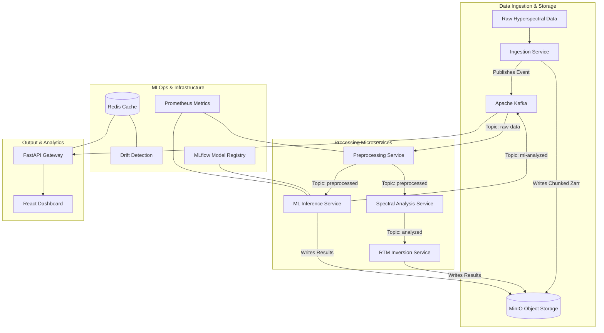

# Scalable Physics-Based Hyperspectral Analysis Pipeline


A production-grade, distributed hyperspectral image processing system that prioritizes computational efficiency and physical interpretability over conventional deep learning approaches. 

This system implements a microservices architecture utilizing Apache Kafka for data streaming, Apache Spark for distributed processing, and MinIO for object storage. It combines the rigorous analytical power of the **PROSAIL Radiative Transfer Model (RTM)** with a highly optimized, **Physics-Guided Lightweight Neural Network** to achieve real-time, CPU-friendly biophysical parameter retrieval.

---

## 🌟 Key Innovations

1. **Physics-Informed Machine Learning (PIML):** Moves away from heavy, black-box Convolutional Neural Networks (CNNs). By extracting physical features (NDVI, Red Edge Position, Absorption Depths) deterministically, the downstream Neural Network only requires ~10,000 parameters. This enables blazing-fast CPU inference (<5ms per pixel) without requiring GPUs.
2. **Big Data Engineering Paradigm:** Hyperspectral cubes are notoriously large and frequently cause Out-Of-Memory (OOM) errors. This pipeline converts raw `.hdr/.bil` files into **chunked Zarr** format and Cloud-Optimized GeoTIFFs (COG), allowing for spatial subsetting and windowed reading.
3. **Event-Driven Microservices:** Processing is decoupled using **Apache Kafka**, allowing independent scaling of ingestion, atmospheric correction, spectral analysis, and ML inference stages.
4. **Full-Lifecycle MLOps:** Integrated with MLflow for experiment tracking, Apache Airflow for automated model retraining, and Prometheus/Grafana for real-time drift detection and monitoring.

---

## 🏗️ System Architecture

The pipeline is built on a containerized, event-driven Kubernetes microservices architecture.



---

## 📦 Component Breakdown

### 1. Core Microservices (`/services`)
*   **Ingestion (`/ingestion`)**: Validates raw data, chunks it into 256x256 Zarr tiles, and uploads to MinIO.
*   **Preprocessing (`/preprocessing`)**: Performs dark object subtraction, flat-field correction, and Savitzky-Golay spectral smoothing.
*   **Spectral Analysis (`/spectral_analysis`)**: Calculates analytical physics equations: First/Second Derivatives, Red Edge Position, Continuum Removal, and Absorption Depths.
*   **RTM Inversion (`/rtm_inversion`)**: Utilizes Look-Up Tables (LUT) to invert the PROSAIL model, solving for biophysical parameters like LAI and chlorophyll concentration.
*   **ML Inference (`/ml_inference`)**: Deploys the PyTorch-based `PhysicsGuidedLightweightNet`.
*   **API Gateway (`/api_gateway`)**: FastAPI entry point featuring JWT authentication, rate limiting, and spatial subsetting (BBox).
*   **Dashboard (`/dashboard`)**: Removed. Replaced by Frontend.
*   **Frontend (`/frontend`)**: Real-time React SPA with rich aesthetics and interactive charting.

### 2. MLOps (`/mlops` & `/monitoring`)
*   **MLflow Tracking (`mlflow_tracking.py`)**: Logs model architectures, physics constraint losses, and prediction accuracy. Manages model promotion to production.
*   **Airflow DAG (`airflow_dag.py`)**: Automated weekly pipeline that checks for model drift and triggers retraining if the KS-test threshold is breached.
*   **Drift Detection (`drift_detection.py`)**: Monitors the statistical distribution of incoming spectra and predicted parameters against a reference baseline using Redis.
*   **Prometheus & Alerting**: Exposes `/metrics` for processing times, Kafka lag, and physics consistency errors. Sends Slack/Email alerts on failure.

### 3. Data Quality (`/data_quality`)
*   **Validator (`validator.py`)**: Intercepts scenes before processing to evaluate Cloud Cover, Signal-to-Noise Ratio (SNR), NaN fractions, and sensor saturation.

### 4. Infrastructure (`/infrastructure`)
*   **Kubernetes Manifests (`/kubernetes`)**: Production deployments, Services (LoadBalancers), ConfigMaps, Secrets, and Horizontal Pod Autoscalers (HPA) targeting CPU/Memory utilization.

---

## 🚀 Quick Start (Development)

Requires **Docker** and **Docker Compose**.

1. **Clone the repository:**
   ```bash
   git clone https://github.com/your-org/hyperspectral-pipeline.git
   cd hyperspectral-pipeline
   ```

2. **Start the development environment:**
   ```bash
   make dev-up
   ```
   This will spin up Kafka, Zookeeper, MinIO, Postgres, Redis, and all microservices.

3. **Access Interfaces:**
   * API Gateway Docs: [http://localhost:8000/docs](http://localhost:8000/docs)
   * Frontend Dashboard: [http://localhost:8501](http://localhost:8501)
   * MinIO Console: [http://localhost:9001](http://localhost:9001) (User/Pass: `minioadmin`)

---

## 🏭 Production Deployment

The production stack includes MLflow, Prometheus, Grafana, and highly-available container configurations.

1. **Configure Environment:**
   Review and update `.env.production` (especially `JWT_SECRET_KEY` and passwords).
   ```bash
   cp .env.example .env.production
   ```

2. **Build and Deploy:**
   ```bash
   make prod-build
   make prod-up
   ```

3. **Kubernetes Deployment:**
   If deploying to a K8s cluster (EKS, GKE, AKS):
   ```bash
   make k8s-deploy
   ```

---

## 🧪 Testing

The system includes a robust suite of unit, integration, and load tests.

```bash
# Run Unit and Integration Tests (Pytest)
make test-all

# Run API Load Tests (Locust)
make test-load

# Run Physics-ML Benchmarks
make benchmark
```

---

## 📖 License

This project is licensed under the MIT License.
